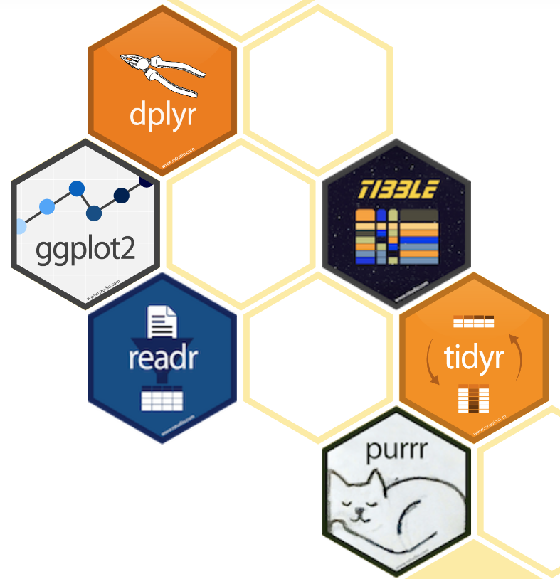
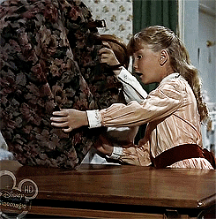
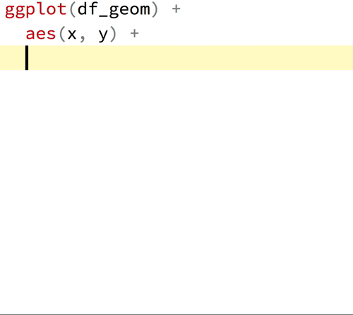

class: fullscreen, inverse, top, center, text-white
background-image: url("images/letter-g.jpg")

.font150[**Brought to you by the letter...**]

```{r setup, include=FALSE}
library(tidyverse)
library(gapminder)
americas <- 
  gapminder %>% 
  filter(
    country %in% c(
      "United States",
      "Canada",
      "Mexico",
      "Ecuador"
    )
  )
knitr::opts_chunk$set(fig.width=4.25, fig.height=3.5, fig.retina=3,
                      out.width = "100%",
                      message=FALSE, warning=FALSE, cache = TRUE, 
                      autodep = TRUE, hiline=TRUE)

knitr::opts_hooks$set(fig.callout = function(options) {
  if (options$fig.callout) {
    options$echo <- FALSE
    options$out.height <- "99%"
    options$fig.width <- 16
    options$fig.height <- 8
  }
  options
})

options(
  htmltools.dir.version = FALSE, 
  width = 90,
  max.print = 9999,
  knitr.table.format = "html"
)

as_table <- function(...) knitr::kable(..., format='html', digits = 3)
```

---
# Learning objectives

.font150[

* Why you should learn .hl[ggplot2] and .hl[dplyr]
* Mechanics and getting started with **ggplot2**
* Transforming data using **dplyr**
* What is the .hl[tidyverse]?

]

---
# What is *ggplot2*?

--

.left-column[

__Hadley Wickham__
]

--

.right-column[.font150[
"[.hl[ggplot2] is] a powerful way of thinking about visualisation, as a way of
**mapping between variables and the visual properties of geometric objects**
that you can perceive."
]
.footnote[<http://disq.us/p/sv640d>]
]

---
# What is *dplyr*?

--

.font150[
.hl[dplyr] provides a set of tools for efficiently manipulating datasets in R.
]

--

.font150[
.hl[Key ideas]:

* Tabular data is tabular data regardless of source
* Most tasks are a composition of simple operations

]

.footnote[
Adapted from <https://blog.rstudio.com/2014/01/17/introducing-dplyr/>
]

---

# What is the *tidyverse*?

.font150[
"The tidyverse is an opinionated .hl[collection of R packages] designed for
data science. All packages have an underlying design
[philosophy](https://www.jstatsoft.org/article/view/v059i10), grammar,
and data structures" ([tidyverse.org](https://tidyverse.org))
]

.left-column[

]

.right-column[.font120[
* `tidyr`: clean and reshape your data
* `readr`: better file parsing
* `tibble`: better data frames
* `purrr`: better functional programming
* ... and many more (i.e. `broom`)...
]]

.footnote[
Incredibly accessible and deep online textbook:
[R for Data Science](https://r4ds.had.co.nz)
]

???

So why should you learn tidyverse? Basically shared design philosophy means
that adopting tools within the tidyverse becomes easier and easier. Things fail
consistently and there are less silent errors due to weird R type stuff. It's
expressive and allow you to think more about what you want to do instead of how
you are going to do it.

---
layout: false
class: inverse center middle text-white

.font200[Getting started with ggplot2]

---
layout: false

# What are we getting into?

<br>
`ggplot2` is a huge package: philosophy + functions
<br>...but it's very well organized

--

<br><br>
*Lots* of examples of not-so-great plots in these slides
<br>...but that's okay

--

<br><br>
Going to throw a lot at you
<br>...but you'll know *where* and *what* to look for

--

.img-right[]

--

.img-right[]

---

# What is the general process for using *ggplot2*?

.font150[
* .hl[Functional] data visualization
    1. Define data being used
    2. Map data to visual elements
    3. Tweak scales, guides, axis, labels, theme
]
--
.font150[
* .hl[Reason] about how data drives the visualization
]
--
.font150[
* .hl[Iterate] on visualization
]

???

Easy to be consistent as we do this process

---

# *gg* is for *grammar of graphics*

.left-code[
"Good grammar is just the first step in creating a good sentence."

#### How is the drawing on the right connected to data?

.footnote[<http://vita.had.co.nz/papers/layered-grammar.pdf>]
]

.right-plot[
```{r guess-data-from-plot-0, echo=FALSE}
df_mpg <- mpg %>% 
  filter(class %in% c("compact", "suv")) %>% 
  filter(manufacturer %in% c("toyota", "ford", "audi")) %>% 
  filter(year == 2008) %>% 
  group_by(manufacturer, model) %>% 
  sample_n(1)

g <- ggplot(df_mpg) +
  aes(x = cty, y = hwy, color = class, shape = manufacturer) +
  geom_point(size = 4) +
  labs(x = NULL, y = NULL, shape = NULL, color = NULL) +
  theme_minimal() +
  theme(
    panel.grid = element_blank(),
    plot.background = element_rect(fill = rgb(250, 250, 250, max = 255),
                                   color = "#777777")
  )

g + 
  guides(color = FALSE, shape = FALSE) +
  theme(axis.text = element_blank())
```
]

---
layout: true
# Guess the data behind this plot?

.left-code[
### MPG Ratings of Cars

- Manufacturer
- Car Type (Class)
- City MPG
- Highway MPG
]

---

.right-plot[
```{r guess-data-from-plot-2, echo=FALSE}
g + guides(color = FALSE, shape = FALSE) +
  theme(axis.text = element_blank())
```
]

---

.right-plot[
```{r guess-data-from-plot-3, echo=FALSE}
g + guides(color = FALSE) +
  theme(axis.text = element_blank())
```
]

---

.right-plot[
```{r guess-data-from-plot-1, echo=FALSE}
g + 
  theme(axis.text = element_blank())
```
]

---

.right-plot[
```{r guess-data-from-plot-4, echo=FALSE}
g
```
]

---

.right-plot[
```{r guess-data-from-plot-5, echo=FALSE}
g + theme(panel.grid.major = element_line(color = "grey90"))
```
]

---

.right-plot[
```{r guess-data-from-plot-6, echo=FALSE}
g + 
  ggtitle("MPG Ratings") +
  labs(x = "City", y = "Highway", shape = "Manufacturer", color = "Class") +
  theme(
    panel.border = element_rect(fill = NA, color = "grey85"),
    panel.grid.major = element_line(color = "grey90")
  )
```
]

---

.right-plot[
```{r guess-data-from-plot-data, echo=FALSE, results='asis'}
df_mpg %>% 
  select(manufacturer, class, cty, hwy, model) %>% 
  knitr::kable()
```
]

---
layout: false
# How do we express visuals in words?

.font120[
- **Data** to be visualized
]

--
.font120[
- **.hlb[Geom]etric objects** that appear on the plot
]

--
.font120[
- **.hlb[Aes]thetic mappings** from data to visual component
]

--
.font120[
- **.hlb[Stat]istics** transform data on the way to visualization
]

--
.font120[
- **.hlb[Coord]inates** organize location of geometric objects
]

--
.font120[
- **.hlb[Scale]s** define the range of values for aesthetics
]

--
.font120[
- **.hlb[Facet]s** group into subplots
]


---
layout: true
# gg is for Grammar of Graphics

.left-column[
### Data

```r
ggplot(data)
```
]

---

.right-column[
#### Tidy Data

1. Each variable forms a .hl[column]

2. Each observation forms a .hl[row]

3. Each observational unit forms a table
]

--

.right-column[
#### Start by asking

1. What information do I want to use in my visualization?

1. Is that data contained in .hl[one column/row] for a given data point?
]

---

.right-column[
```{r tidy-messy1, results='asis', echo=FALSE}
pop_simple <- gapminder %>% 
  filter(
    country %in% c("Canada", "China", "United States"), 
    year >= 1997
  ) %>% 
  select(country, year, pop) %>% 
  mutate(pop = pop / 10^6)

messy_pop <- pop_simple %>% spread(year, pop)

knitr::kable(messy_pop, format = 'html')
```
]

--

.right-column[
```{r tidy-tidy1, result='asis', echo=1:2}
# NOTE: using `tidyr` here, pivoting "longer"
tidy_pop <- gather(messy_pop, 'year', 'pop', -country)
as_table(tidy_pop)
```
]


---
layout: true
# gg is for Grammar of Graphics

.left-column[
### Data
### Aesthetics

```r
+ aes()
```

]
---

.right-column[
Map data to visual elements or parameters

- year

- pop

- country
]

---

.right-column[
Map data to visual elements or parameters

- year → **x**

- pop → **y**

- country → *shape*, *color*, etc.
]

---

.right-column[
Map data to visual elements or parameters

```r
aes(
  x = year,
  y = pop,
  color = country
)
```
]

---
layout: true
# gg is for Grammar of Graphics

.left-column[
### Data
### Aesthetics
### Geoms

```r
+ geom_*()
```
]

---

.right-column[
Geometric objects displayed on the plot

```{r geom_demo, echo=FALSE, fig.width=6, out.width="650px"}
minimal_theme <- theme_bw() +
  theme(
    axis.text = element_blank(),
    axis.ticks = element_blank(),
    panel.grid = element_blank(),
    panel.border = element_blank(),
    axis.title = element_blank(),
    plot.title = element_text(hjust = 0.5),
    text = element_text(family = "Fira Mono"),
    plot.background = element_rect(fill = "#FAFAFA", color = NA),
    panel.background = element_rect(fill = "#FAFAFA", color = NA)
  )

set.seed(4242)
df_geom <- tibble(y = rnorm(10), x = 1:10)

g_geom <- list()
g_geom$point <- ggplot(df_geom, aes(x, y)) + geom_point() + ggtitle("geom_point()")
g_geom$line <- ggplot(df_geom, aes(x, y)) + geom_line() + ggtitle("geom_line()")
g_geom$bar <- ggplot(df_geom, aes(x, y)) + geom_col() + ggtitle("geom_col()")
g_geom$boxplot <- ggplot(df_geom, aes(y = y)) + geom_boxplot() + ggtitle("geom_boxplot()")
g_geom$histogram <- ggplot(df_geom, aes(y)) + geom_histogram(binwidth = 1) + ggtitle("geom_histogram()")
g_geom$density <- ggplot(df_geom, aes(y)) + geom_density(fill = "grey40", alpha = 0.25) + ggtitle("geom_density()") + xlim(-4, 4)

g_geom <- map(g_geom, ~ . + minimal_theme)

cowplot::plot_grid(plotlist = g_geom)
```
]

---

.right-column[
Here are the [some of the most widely used geoms](https://eric.netlify.com/2017/08/10/most-popular-ggplot2-geoms/)

.font70.center[
| Type | Function |
|:----:|:--------:|
| Point | `geom_point()` |
| Line | `geom_line()` |
| Bar | `geom_bar()`, `geom_col()` |
| Histogram | `geom_histogram()` |
| Regression | `geom_smooth()` |
| Boxplot | `geom_boxplot()` |
| Text | `geom_text()` |
| Vert./Horiz. Line | `geom_{vh}line()` |
| Count | `geom_count()` |
| Density | `geom_density()` |

<https://eric.netlify.com/2017/08/10/most-popular-ggplot2-geoms/>
]
]


---

.right-column[

See <http://ggplot2.tidyverse.org/reference/> for many more options

.font70[
```{r ggplot2-geom-names, echo=FALSE}
# geom_
old_width = options(width = 80)
lsf.str("package:ggplot2") %>% grep("^geom_", ., value = TRUE)
options(width = old_width$width)
```
]
]
--

.right-column[

Or just start typing `geom_` in RStudio
]


---
layout: true
# Our first plot!
---

.left-code[
```{r first-plot1a, eval=FALSE}
ggplot(tidy_pop)
```
]

.right-plot[
```{r first-plot1a-out, ref.label='first-plot1a', echo=FALSE, out.width="100%"}
```
]

---

.left-code[
```{r first-plot1b, eval=FALSE}
ggplot(tidy_pop) +
  aes(x = year, #<<
      y = pop) #<<
```
]

.right-plot[
```{r first-plot1b-out, ref.label='first-plot1b', echo=FALSE, out.width="100%"}
```
]

---

.left-code[
```{r first-plot1c, eval=FALSE}
ggplot(tidy_pop) +
  aes(x = year,
      y = pop) +
  geom_point() #<<
```
]

.right-plot[
```{r first-plot1c-out, ref.label='first-plot1c', echo=FALSE, out.width="100%"}
```
]

---

.left-code[
```{r first-plot1, eval=FALSE}
ggplot(tidy_pop) +
  aes(x = year,
      y = pop,
      color = country) + #<<
  geom_point()
```
]

.right-plot[
```{r first-plot1-out, ref.label='first-plot1', echo=FALSE, out.width="100%"}
```
]

---

.left-code[
```{r first-plot2-fake, eval=FALSE}
ggplot(tidy_pop) +
  aes(x = year,
      y = pop,
      color = country) +
  geom_point() +
  geom_line() #<<
```

.font80[
```r
geom_path: Each group consists
of only one observation. 
Do you need to adjust the 
group aesthetic?
```
]
]

.right-plot[
```{r first-plot2-fake-out, ref.label='first-plot2-fake', echo=FALSE, out.width="100%"}
```
]
---

.left-code[
```{r first-plot2, eval=FALSE}
ggplot(tidy_pop) +
  aes(x = year,
      y = pop,
      color = country) +
  geom_point() +
  geom_line(
    aes(group = country)) #<<
```
]

.right-plot[
```{r first-plot2-out, ref.label='first-plot2', echo=FALSE, out.width="100%"}
```
]

---


.left-code[
```{r first-plot3, eval=FALSE}
g <- ggplot(tidy_pop) +
  aes(x = year,
      y = pop,
      color = country) +
  geom_point() +
  geom_line(
    aes(group = country))

g
```
]

.right-plot[
```{r first-plot3-out, ref.label='first-plot2', echo=FALSE, out.width="100%"}
```
]

---
layout: true
# gg is for Grammar of Graphics

.left-column[
### Data
### Aesthetics
### Geoms

```r
+ geom_*()
```
]
---

.right-column[
```r
geom_*(mapping, data, stat, position)
```

- `data` Geoms can have their own data
    - Has to map onto global coordinates

- `map` Geoms can have their own aesthetics
    - Inherits global aesthetics
    - Have geom-specific aesthetics
        - `geom_point` needs `x` and `y`, optional `shape`, `color`, `size`, etc.
        - `geom_ribbon` requires `x`, `ymin` and `ymax`, optional `fill`
    - `?geom_ribbon`
]

---

.right-column[
```r
geom_*(mapping, data, stat, position)
```

- `stat` Some geoms apply further transformations to the data
    - All respect `stat = 'identity'`
    - Ex: `geom_histogram` uses `stat_bin()` to group observations
    
- `position` Some adjust location of objects
    - `'dodge'`, `'stack'`, `'jitter'`
]

---
layout: true
# gg is for Grammar of Graphics

.left-column[
### Data
### Aesthetics
### Geoms
### Facet

```r
+facet_wrap() 

+facet_grid()
```
]
---

```{r geom_facet_setup, include=FALSE}
tidy_pop <- left_join(tidy_pop, select(gapminder, country, continent))

g <- ggplot(tidy_pop) +
  aes(x = year,
      y = pop,
      color = country) +
  geom_point() +
  geom_line(aes(group = country))
```

.right-column[
```{r geom_facet, echo=TRUE, out.width="90%", fig.width=6}
g + facet_wrap(~ country)
```
]

---

.right-column[
```{r geom_grid, echo=TRUE, out.width="90%", fig.width=6}
g + facet_grid(continent ~ country)
```
]

---
layout: true
# gg is for Grammar of Graphics

.left-column[
### Data
### Aesthetics
### Geoms
### Facet
### Labels

```r
+ labs()
```
]
---

.right-column[
```{r labs-ex, echo=TRUE, out.width="90%", fig.width=6}
g + labs(x = "Year", y = "Population")
```
]

---
layout: true
# gg is for Grammar of Graphics

.left-column[
### Data
### Aesthetics
### Geoms
### Facet
### Labels
### Coords

```r
+ coord_*()
```
]
---

.right-column[
```{r coord-ex, echo=TRUE, out.width="90%", fig.width=6}
g + coord_flip()
```
]

---

.right-column[
```{r coord-ex2, echo=TRUE, out.width="90%", fig.width=6}
g + coord_polar()
```
]

---
layout: true
# gg is for Grammar of Graphics

.left-column[
### Data
### Aesthetics
### Geoms
### Facet
### Labels
### Coords
### Scales

```r
+ scale_*_*()
```
]
---

.right-column[ 
`scale` + `_` + `<aes>` + `_` + `<type>` + `()`

What parameter do you want to adjust? → `<aes>` <br>
What type is the parameter? → `<type>`

- I want to change my discrete x-axis<br>`scale_x_discrete()`
- I want to change range of point sizes from continuous variable<br>`scale_size_continuous()`
- I want to rescale y-axis as log<br>`scale_y_log10()`
- I want to use a different color palette<br>`scale_fill_discrete()`<br>`scale_color_manual()`
]

---

.right-column[
```{r scale_ex1, out.width="90%", fig.width=6}
g + scale_color_manual(values = c("peru", "pink", "plum"))
```
]

---

.right-column[
```{r scale_ex2, out.width="90%", fig.width=6}
g + scale_y_log10()
```
]

---

.right-column[
```{r scale_ex4, out.width="90%", fig.width=6}
g + scale_x_discrete(labels = c("MCMXCVII", "MMII", "MMVII"))
```
]

---
layout: true
# gg is for Grammar of Graphics

.left-column[
### Data
### Aesthetics
### Geoms
### Facet
### Labels
### Coords
### Scales
### Theme

```r
+ theme()
```
]

---

.right-column[
Change the appearance of plot decorations<br>
i.e. things that aren't mapped to data

A few "starter" themes ship with the package

- `g + theme_bw()`
- `g + theme_dark()`
- `g + theme_gray()`
- `g + theme_light()`
- `g + theme_minimal()`

]

---

.right-column[
Huge number of parameters, grouped by plot area:

- Global options: `line`, `rect`, `text`, `title`
- `axis`: x-, y- or other axis title, ticks, lines
- `legend`: Plot legends
- `panel`: Actual plot area
- `plot`: Whole image
- `strip`: Facet labels
]

Check out3
[emilyriederer/ugliest-ggplot-theme.R](https://gist.github.com/emilyriederer/2bf4f67d7e198f8359b61706c82e42ee)!

---

.right-column[
Theme options are supported by helper functions:

- `element_blank()` removes the element
- `element_line()`
- `element_rect()`
- `element_text()`

]

---

.right-column[
```{r, out.width="90%", fig.width=6}
g + theme_bw()
```
]

---

.right-column[
.font80[
```{r, out.width="90%", fig.width=6}
g + theme_minimal() + theme(text = element_text(family = "Palatino"))
```
]
]

---

.right-column[
You can also set the theme globally with `theme_set()`

```{r theme_set}
my_theme <- theme_bw() +
  theme(
    text = element_text(family = "Palatino", size = 12),
    panel.border = element_rect(colour = 'grey80'), 
    panel.grid.minor = element_blank()
  )

theme_set(my_theme)
```

All plots will now use this theme!
]

---

.right-column[
```{r, out.width="90%", fig.width=6, dependson='theme_set'}
g
```
]

---

.right-column[
```{r, out.width="90%", fig.width=6, dependson='theme_set'}
g + theme(legend.position = 'bottom')
```
]

---
layout: false
# Save Your Work

To save your plot, use **ggsave**

```{r ggsave, eval=FALSE}
ggsave(
  filename = "my_plot.png",
  plot = my_plot,
  width = 10,
  height = 8,
  dpi = 100,
  device = "png"
)
```

---
layout: false
count: hide
class: fullscreen, inverse, top, left, text-white
background-image: url(images/super-grover.jpg)

.font200[You have the power!]

---
layout: false
class: inverse center middle text-white

.font200[Getting started with dplyr]

.footnote[
Inspired by
[dplyr slides](https://therbootcamp.github.io/BaselRBootcamp_2018April/_sessions/D2S1_Wrangling/Wrangling.html)
]

---

# What is *dplyr*?

.pull-left[
.font150[
.hl[dplyr] combines:
]

.font140[
1. .hl[tables]
2. .hl[verbs] that .hl[do] things to tables
3. .hl[pipes] that string together tables and verbs
]

.font150[
Most tasks can be written as a sequence of simple verbs.
]
]

--

.pull-right[
## The pipe %>%

I want to apply `A`, `B`, then `C` on `df`.

{{content}}
]

--

### without pipes

```{r dplyr-without-pipes, eval=FALSE}
C(B(A(df)))  # like, please don't.
```

{{content}}

--

### with pipes

```{r dplyr-with-pipes, eval=FALSE}
df %>%  # start with df
  A() %>%  # then apply A
  B() %>%  # then apply B
  C()  # then apply C
```

---
layout: true
# Single-table verbs
---

.font130[
Most comon set of verbs:

+ `mutate()`: new variables as functions of existing variables
+ `select()`: select subset of variables (columns)
+ `filter()`: select subset of observations (rows)
+ `arrange()`: reorder observations
+ `summarize()`: reduce multiple observations to single summary
]

--

.font130[
Combine with `group_by()` which allows performing operations "by group"
]

---

.right-column[
```{r dplyr-before-anything, echo=FALSE}
as_table(messy_pop)
```
.center[
Examples operating on the table `messy_pop`...
]
]

---

.left-column[
### Mutate
```{r sidebar-mutate, eval=FALSE}
mutate(...) #<<
```
]

.column-right[
```{r dplyr-before-mutate, echo=FALSE}
as_table(messy_pop)
```
```{r dplyr-after-mutate-echo, eval=FALSE}
messy_pop %>%
  mutate(average=(`1997` + `2002` + `2007`) / 3)  #<<
```
```{r dplyr-after-mutate-eval, echo=FALSE}
messy_pop %>%
  mutate(average=(`1997` + `2002` + `2007`) / 3) %>%
  as_table()
```
]


---

.left-column[
### Mutate
### Select
```{r sidebar-select, eval=FALSE}
select(...) #<<
```
]
.column-right[
```{r dplyr-before-select, echo=FALSE}
as_table(messy_pop)
```
```{r dplyr-after-select-echo, eval=FALSE}
messy_pop %>%
  select(`1997`, `2007`)  #<<
```
```{r dplyr-after-select-eval, echo=FALSE}
messy_pop %>% select(`1997`, `2007`) %>%
  as_table()
```
]
---

.left-column[
### Mutate
### Select
### Filter
```{r sidebar-filter, eval=FALSE}
filter(...) #<<
```
]
.column-right[
```{r dplyr-before-filter, echo=FALSE}
as_table(messy_pop)
```
```{r dplyr-after-filter-echo, eval=FALSE}
messy_pop %>%
  filter(`2002` < 500)  #<<
```
```{r dplyr-after-filter-eval, echo=FALSE}
messy_pop %>%
  filter(`2002` < 500) %>%
  as_table()
```
]
---

.left-column[
### Mutate
### Select
### Filter
### Arrange
```{r sidebar-arrange, eval=FALSE}
arrange(...) #<<
```
]
.column-right[
```{r dplyr-before-arrange, echo=FALSE}
as_table(messy_pop)
```
```{r dplyr-after-arrange-echo, eval=FALSE}
messy_pop %>%
  arrange(desc(`2002`))  #<<
```
```{r dplyr-after-arrange-eval, echo=FALSE}
messy_pop %>%
  arrange(desc(`2002`)) %>%
  as_table()
```
]
---

.left-column[
### Mutate
### Select
### Filter
### Arrange
### Summarize
```{r sidebar-summarize, eval=FALSE}
summarize(...) #<<
```
]
.column-right[
```{r dplyr-before-summarize, echo=FALSE}
as_table(messy_pop)
```
```{r dplyr-after-summarize-echo, eval=FALSE}
messy_pop %>%
  summarize(`1997` = mean(`1997`), `2002` = mean(`2002`))  #<<
```
```{r dplyr-after-summarize-eval, echo=FALSE}
messy_pop %>%
  summarize(`1997` = mean(`1997`), `2002` = mean(`2002`)) %>%
  as_table()
```
]

---
layout: true
# Single-table verbs

.left-column[
### Mutate
### Select
### Filter
### Arrange
### Summarize
### Group by
```{r sidebar-group_by, eval=FALSE}
group_by(...) #<<
```
]

---

.right-column[
```{r dplyr-before-groupby, echo=-1}
set.seed(42)
americas %>%  # has 48 rows
  sample_n(6)
```
]

---

.right-column[
```{r dplyr-before-groupby-compute-echo, eval=FALSE}
americas %>%
  summarize(lifeExp=mean(lifeExp), gdbPercap=mean(gdpPercap)) %>%
  arrange(lifeExp)
```
```{r dplyr-before-groupby-compute-eval, echo=FALSE}
americas %>%
  summarize(lifeExp=mean(lifeExp), gdbPercap=mean(gdpPercap)) %>%
  arrange(lifeExp) %>%
  as_table()
```
]

---

.right-column[
```{r dplyr-after-groupby-echo, eval=FALSE}
americas %>%
  group_by(country) %>%  #<<
  summarize(lifeExp=mean(lifeExp), gdbPercap=mean(gdpPercap)) %>%
  arrange(lifeExp)
```
```{r dplyr-after-groupby-eval, echo=FALSE}
americas %>%
  group_by(country) %>%
  summarize(lifeExp=mean(lifeExp), gdbPercap=mean(gdpPercap)) %>%
  arrange(lifeExp)
```
]

---
layout: false

# Two-table verbs

## When we have multiple tables contributing to an analysis...

.font120[
+ .hl[Mutating joins]: Add variables from one table to another with matching columns
+ .hl[Filtering joins]: Keep/remove observations using matches in another table
+ .hl[Set operations]: Treat rows as elements of a mathematical set

See
[`vignette("two-table")`](https://dplyr.tidyverse.org/articles/two-table.html)
for more details...
]

---
layout: false
class: inverse center middle text-white

.font200[
Tidyverse and other packages
]

---
# Not enough time to go over all the great packages...

### Tidyverse

+ .hl[`tidyr`]: tidy the messiest of data
+ .hl[`purrr`]: take apply and Reduce to the next level
+ .hl[`stringr`]: sane string handling (have you ever tried `"hello" + "world"`?)
+ .hl[`forcats`]: sane factors and handy releveling (R's most confusing datatype)
+ .hl[`readxl`]: when your wet-lab collaborator gives you an Excel spreadsheet
+ .hl[`broom`]: turn statistical/ML models into tidy tables (*sorry I wasn't able to do this*!)

### Other packages

+ [ggplot2 extensions (link)](http://www.ggplot2-exts.org/gallery/): especially
  .hl[`cowplot`] or .hl[`egg`] for multi-plot figures
+ .hl[`data.table`] and/or .hl[`sparklyr`]: when you have to work with really
  large data
+ [Bioconductor (link)](https://www.bioconductor.org/install/): open source
  software for bioinformatics

.footnote[
Broom + tidyr + purrr can be used to do some serious cross-validation: see
[tutorial](http://sjspielman.org/bio5312_fall2017/files/kfold_supplement.pdf)
]

---
# Last tips and tricks, other resources

.font150[
+ Subsample your data (`dplyr::sample_{frac,n}`) when testing code
+ [Simulate random data](https://bookdown.org/ndphillips/YaRrr/generating-random-data.html)
  to gain intuition/check assumptions
.font80[
  - Especially as a sanity check when thinking about weird distributions for GCB 533
]
+ Look at your data when analyzing it ([pathologic cases](https://en.wikipedia.org/wiki/Anscombe%27s_quartet))
+ Organizing analyses ([Noble et al 2009](https://journals.plos.org/ploscompbiol/article?id=10.1371/journal.pcbi.1000424))
+ Learn to use version control ([slides](http://jtleek.com/advdatasci/slides/02-organizing-version-control-slides.html))
+ Ask for help!
]

---
layout: false
class: inverse center middle text-white

.font200[
Questions and practicum
]